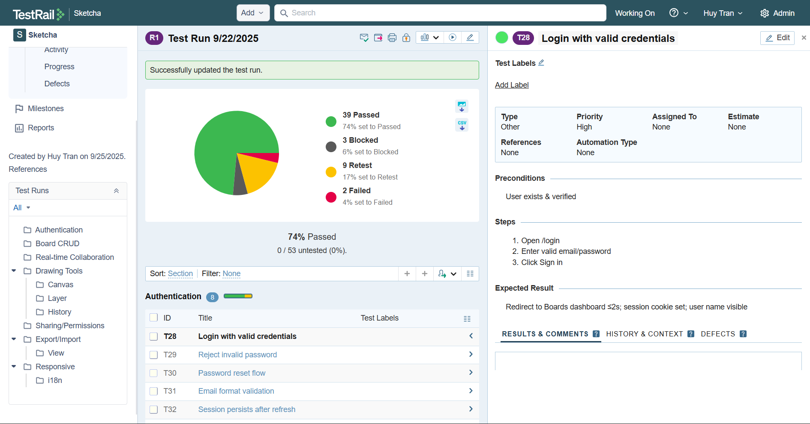

# 🧪 QA Portfolio – Sketcha (Collaborative Whiteboard)

Welcome to my **QA Portfolio Project** where I demonstrate end-to-end manual testing workflow on a real web app scenario.

## 📌 Project Overview
- **Application Under Test (AUT):** *Sketcha* – a collaborative whiteboard web app (Group Web App).
- **Scope:** Auth · Board CRUD · Realtime Collaboration · Canvas Tools · Layers · History · Export/Import · Share/Permissions · Responsive · i18n.
- **Focus:** Manual testing design & execution, realtime sync verification, bug reporting, and sprint-level reporting.

---

## 📂 Deliverables

| Artifact | File/Link |
|----------|-----------|
| **Test Plan** | [📄 Sketcha_TestPlan.md](./Sketcha_TestPlan.md) |
| **Test Cases (45)** | [📑 Sketcha_TestCases.csv](./Sketcha_TestCases.csv) *(import-ready for TestRail/Sheets)* |
| **Bug Reports (samples)** | [🐞 BugReports/](./BugReports) |
| **Sprint QA Report** | [📊 SprintReport.md](./SprintReport.md) |
| **Mind Map** | [🗺 Sketcha_Mindmap.mmd](./Sketcha_Mindmap.mmd) *(Mermaid format)* |
| **TestRail Screenshots** | [🖼 Screenshots/](./Screenshots) |

---

## 📸 TestRail Screenshots

### 1. TestRail Sections

  
   <em>Click to view full image</em>

### 2. TestRail Test Run

  
   <em>Click to view full image</em>

---

👤 **Author:** Tran Phuong Quang Huy  
🎯 Target Role: QA/QC Intern (Web/App Testing)  
📧 Contact: tpqhuy.work@gmail.com | [LinkedIn](https://www.linkedin.com/in/tpqhuy/)

